# Auditoría visual y de uso

## Alcance y evidencia

Objetivo: que un visitante entienda el servicio, que el negocio pueda iniciar su alta y que el cliente final encuentre y gestione su cita sin confundir ambos accesos.

Se revisaron rutas y componentes del checkout `cfb28fa`, los tokens y el plan existente. La inspección visual se hizo en Chrome sobre `http://micitaentiempo.localhost:8080`, usando el entorno local `mcet-ci` y sus datos de prueba. El navegador integrado no estaba disponible. El gateway informa revisión `ci`, no un SHA; no se certificó identidad binaria entre esas imágenes y el checkout. Los hallazgos de código se identifican por separado.

Capturas obtenidas en esta sesión, guardadas e inspeccionadas. Escritorio normal: viewport de 1871 px; reserva también a 1440 × 1024. Móvil emulado: viewport configurado a 390 × 844; el ancho útil puede restar la barra de desplazamiento. No son pruebas en dispositivo físico.

## Recorrido capturado

### 1. Inicio en escritorio — correcto con oportunidades de jerarquía

El beneficio principal y la acción de alta se entienden. La muestra de reserva explica el producto. Seis tarjetas equivalentes diluyen la prioridad; «Mis citas» no aparece en la cabecera ni el pie. Propuesta: entrada del cliente final visible y demostración del recorrido más prominente. No se midió conversión.

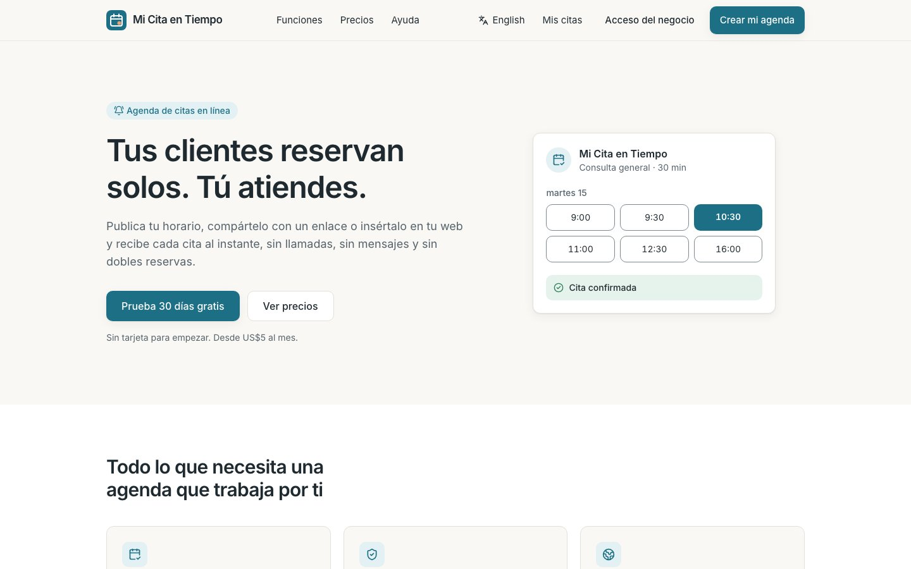

### 2. Precios — claro, con incoherencia de estado comercial

Los dos planes se comparan con facilidad y la moneda está declarada. El aviso de pago próximo convive con afirmaciones de prueba de 30 días, caducidad y prorrateo. Adaptar todos esos textos a la disponibilidad efectiva de cobro. Alinear verticalmente las acciones y justificar el énfasis del plan Sucursales por adecuación, sin inventar popularidad.

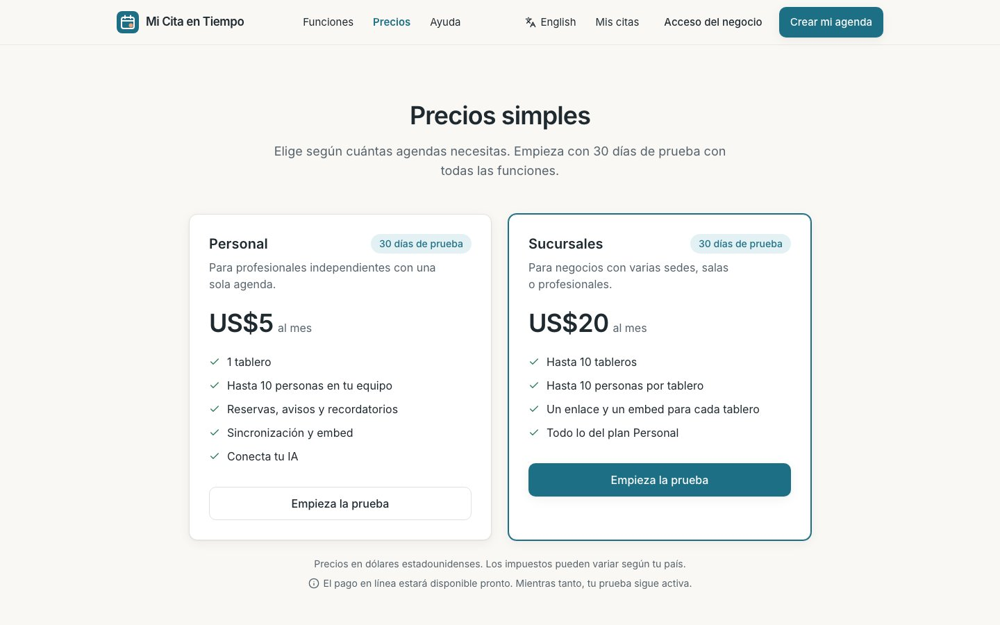

### 3. Reserva no disponible — necesita salida útil

`/reservar/consultas` muestra un aviso claro, con icono y texto. «Este tablero» usa vocabulario interno y no ofrece siguiente paso. Propuesta: «Este negocio no recibe reservas en línea por ahora», acceso a Mis citas y contacto del negocio únicamente si existe un dato configurado.

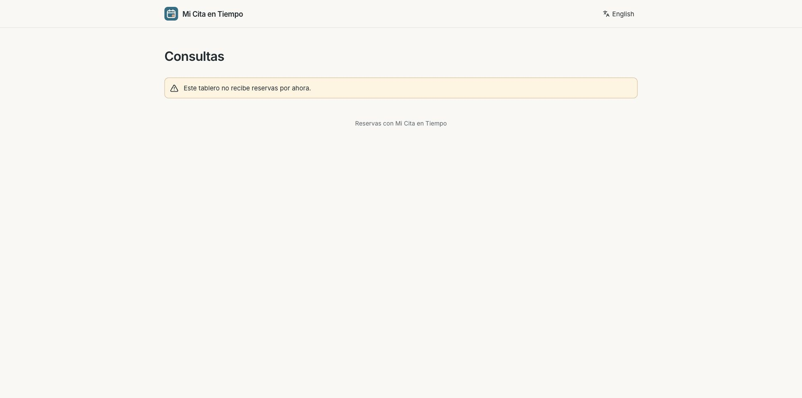

### 4. Mis citas, acceso — claro pero difícil de descubrir

El acceso sin contraseña y el envío de código se explican bien. El título queda separado del formulario en escritorio. Propuesta: agrupar título y formulario, conservar la explicación del correo y enlazar este acceso desde la navegación pública. Solo se inspeccionó el acceso; la lista autenticada y sus acciones se revisaron en código.

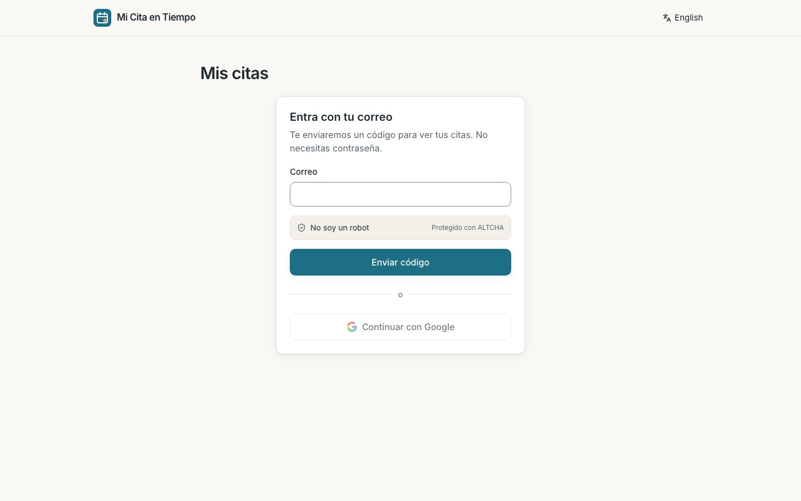

### 5. Registro móvil — buena base, falta precisar la audiencia

Etiquetas visibles, campos amplios y ayuda para contraseña. «Crea tu cuenta» no explica que esta alta corresponde a quien administra una agenda. Propuesta: «Crea la agenda de tu negocio» y enlace «¿Ya tienes una cita? Consulta Mis citas». El estado comercial debe coincidir con Precios. No se creó una cuenta.

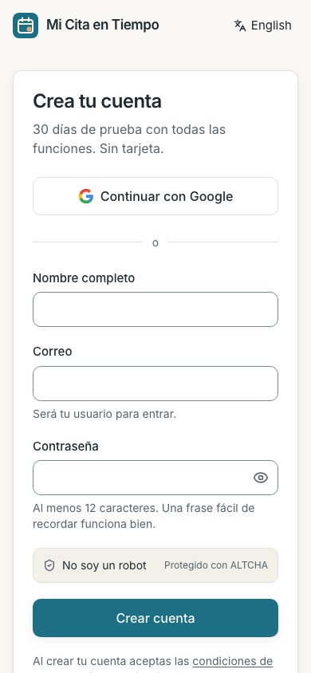

### 6. Inicio móvil — legible, muestra del producto baja

La cabecera colapsa y las acciones caben. La demostración aparece al final del primer viewport después de texto y dos botones. Reducir la introducción, mantener una acción dominante y convertir la segunda en enlace. El objetivo es que el producto se entienda antes de recorrer una lista larga de beneficios.

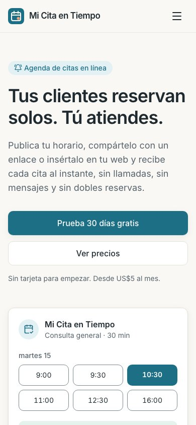

### 7. Reserva, fecha y hora móvil — necesita contexto y etapas coherentes

`/reservar/consultas-88d5a` muestra disponibilidad real del entorno de prueba. Calendario y horas tienen etiquetas accesibles completas. El paso activo dice «3. Hora» aunque todavía se elige día; «2. Día» nunca se activa en ese estado. El servicio único y su duración no aparecen. El identificador `America/Mexico City` es poco natural. Propuesta: servicio y duración persistentes, etapa «Fecha y hora», zona con ciudad y desfase vigente, selector con búsqueda al cambiarla.

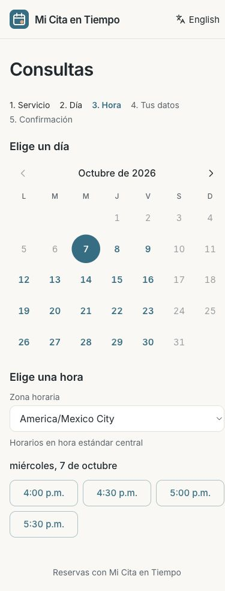

### 8. Reserva, datos móvil — resumen incompleto

Se seleccionó 4:30 p. m. y se llegó a Tus datos. El resumen conserva servicio y fecha, pero no duración ni zona horaria explícita. «Nota para el negocio» no indica que es opcional. El botón de apartar describe una acción distinta a la confirmación, lo cual es positivo. Propuesta: resumen completo, opcionales plegables y aviso claro de que sigue la verificación por correo. No se enviaron datos ni se generó un hold.

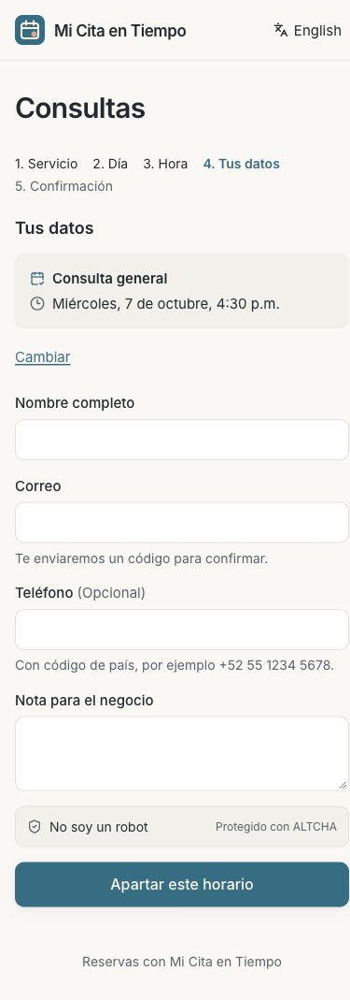

### 9. Reserva en escritorio — calendario sobredimensionado

Los dos grupos se distinguen, pero el calendario se estira y los horarios quedan aislados a la derecha. Falta el contexto del servicio. La captura a 1440 × 1024 sustenta la propuesta de una retícula compacta con resumen lateral y ancho controlado.

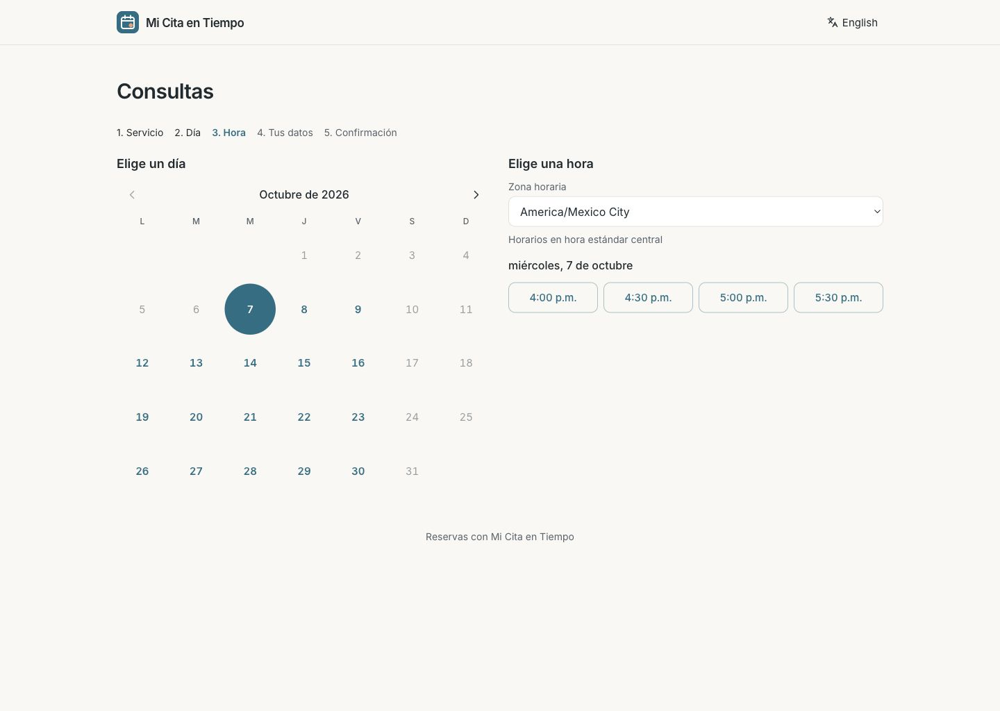

### 10. Funciones — completa, demasiado uniforme

Seis grupos con igual tratamiento visual obligan a leer muchas prestaciones antes de ver cómo funciona. Propuesta: ordenar por recorrido «Configura tu agenda → Recibe reservas → Gestiona cambios», con muestras concretas de UI; conservar el detalle en secciones secundarias. No se verificaron aquí todas las integraciones anunciadas.

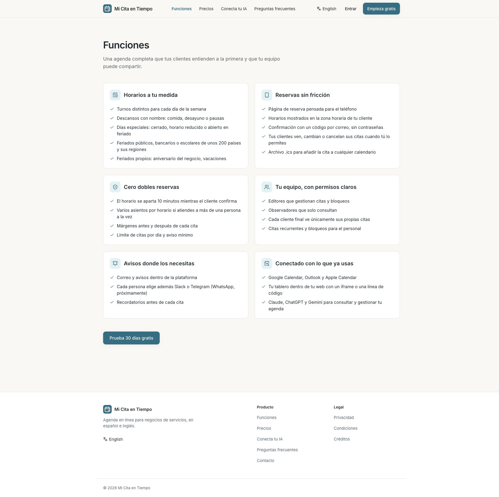

### 11. Preguntas frecuentes — interacción correcta, ancho excesivo

Se abrió la primera respuesta con Enter y se inspeccionó el foco visible. El patrón nativo funciona. La respuesta se extiende demasiado en escritorio; aplicar el ancho de lectura previsto y separar preguntas de negocio y cliente cuando el contenido crezca. No se hizo una pasada completa con lector de pantalla.

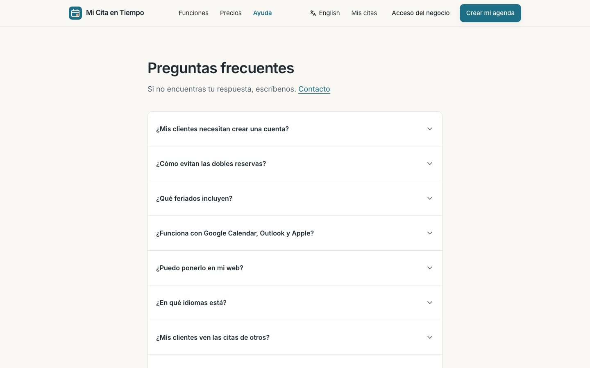

### 12. Contacto — corregir ancho y contorno de campos

El formulario es sencillo y sus etiquetas son claras. Medición DOM: contenedor de 1152 px, campos de 1104 px, altura de 44 px y texto de 16 px. La página solicita `max-w-2xl`, pero se impone `max-w-6xl` del componente compartido. El borde de campo es muy tenue. Propuesta: contenedor de formulario explícito, contorno funcional con suficiente contraste y conservar datos cuando falle el envío. No se envió un mensaje.

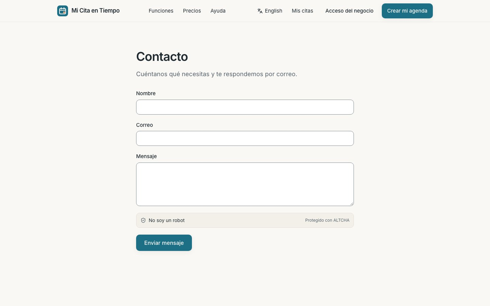

### 13. Conecta tu IA — información útil, carga inicial elevada

La URL se puede localizar y hay instrucciones por asistente. La primera vista combina explicación, endpoint y cinco conjuntos de instrucciones técnicas. Propuesta: empezar por un ejemplo de tarea, permitir elegir asistente y mostrar solo sus pasos. La auditoría evalúa la presentación; no certifica vigencia de planes o instrucciones de proveedores externos.

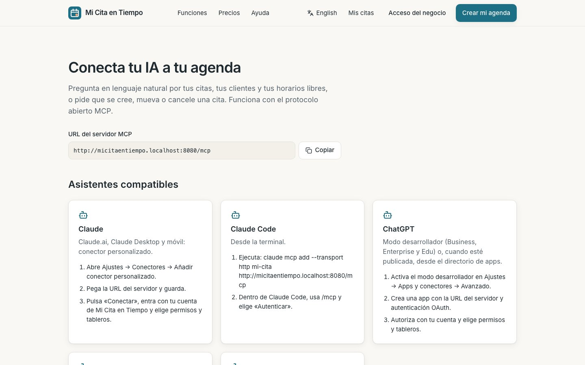

### 14. Entrar — formulario claro, audiencia ambigua

La tarjeta concentra la tarea y ofrece recuperación de contraseña. Falta aclarar «Acceso del negocio» y una alternativa directa a Mis citas. Se capturó el formulario sin enviar credenciales. La captura muestra el botón atenuado; no se concluye su causa a partir de la imagen.

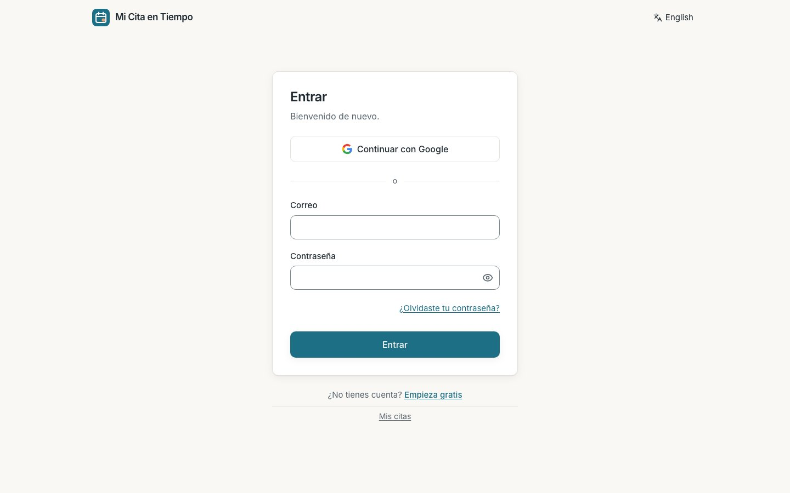

## Hallazgos de código que complementan las capturas

Las rutas siguientes son relativas a la raíz del repositorio. Son observaciones estáticas, salvo cuando se indica captura o medición.

| Prioridad | Ubicación | Hallazgo y acción propuesta |
|---|---|---|
| Alta | `services/web/app/components/ui.tsx:67` | El contenedor añade siempre `max-w-6xl`; `cx` solo concatena. Definir una única variante de ancho. Confirmado en Contacto; revisar también FAQ, legales y reserva. |
| Alta | `services/web/app/components/booking-flow.tsx:171` | `slot` activa índice 2; no existe un estado que active Día. Unificar fecha/hora. |
| Alta | `services/web/app/components/booking-flow.tsx:223` | Contexto de servicio condicionado a más de un servicio. Mostrarlo siempre con duración. |
| Alta | `services/web/app/components/booking-flow.tsx:145` | Resumen sin duración ni zona explícita. Completar en datos, verificación y confirmación. |
| Alta | `services/web/app/components/slot-picker.tsx:58` | Una respuesta no exitosa y un error de red terminan como lista vacía. Diferenciar «sin horarios» de «no pudimos cargar» y ofrecer Reintentar. No se inyectó un error en navegador. |
| Alta | `services/web/app/components/my-appointments.tsx:30` | Error inicial distinto de 401 deja `signedIn` en null; el retorno de carga de la línea 65 oculta el aviso. Crear estado de error recuperable. No reproducido en navegador. |
| Media | `services/web/app/components/my-appointments.tsx:173` | Elegir un horario al reprogramar dispara la mutación inmediatamente. Proponer revisión explícita de hora anterior/nueva antes de guardar. |
| Media | `services/web/app/components/ui.tsx:131` | Separar token de borde decorativo del borde que identifica campos; ratio actual 1,31:1 sobre blanco. Evaluar requisito de contraste no textual en contexto. |
| Media | `services/web/app/routes/embed.tsx:58` | `role=tab` sin asociación a `tabpanel`, ni navegación de flechas; controles de 40 px frente al objetivo de 44 px del proyecto. Completar el patrón o usar botones de vista simples. |
| Media | `services/web/app/components/booking-flow.tsx:269` | Campos de datos sin `name`; añadir nombres semánticos y asociar errores específicos. |
| Media | `services/web/app/components/booking-flow.tsx:251` | Cambios de etapa no gestionan foco explícitamente. Llevar foco al título nuevo y anunciar el cambio; validar con teclado. |
| Baja | `services/web/app/routes/booking.tsx:28` | El acceso de salto usado en páginas comerciales no está en esta cabecera. Unificar el patrón accesible en acceso y cliente final. |

## Fortalezas a conservar

Inter autoalojada, tokens claros/oscuros, tamaños base de 16 px, foco global visible, `prefers-reduced-motion`, etiquetas y ayudas asociadas en `Field`, semántica nativa en FAQ y fechas por `Intl`. Las mediciones confirman buenos contrastes para texto principal, secundario y color primario. Esto no equivale a conformidad completa de accesibilidad.

## Límites

No se completaron verificación OTP, confirmación, cancelación, reprogramación, alta ni panel autenticado. No se capturaron inglés, modo oscuro, legales, recuperación, invitación ni embed en iframe. Esas superficies tienen especificaciones y pruebas pendientes en la propuesta; no se presentan como auditadas visualmente. La sesión de navegador se desconectó al continuar desde Entrar hacia Privacidad; no hay captura aceptada de Privacidad. No se hicieron pagos, envíos externos ni despliegues.
