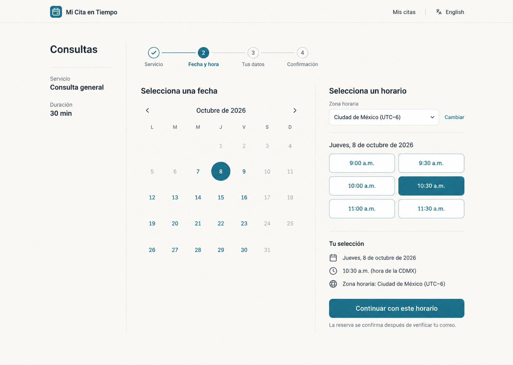
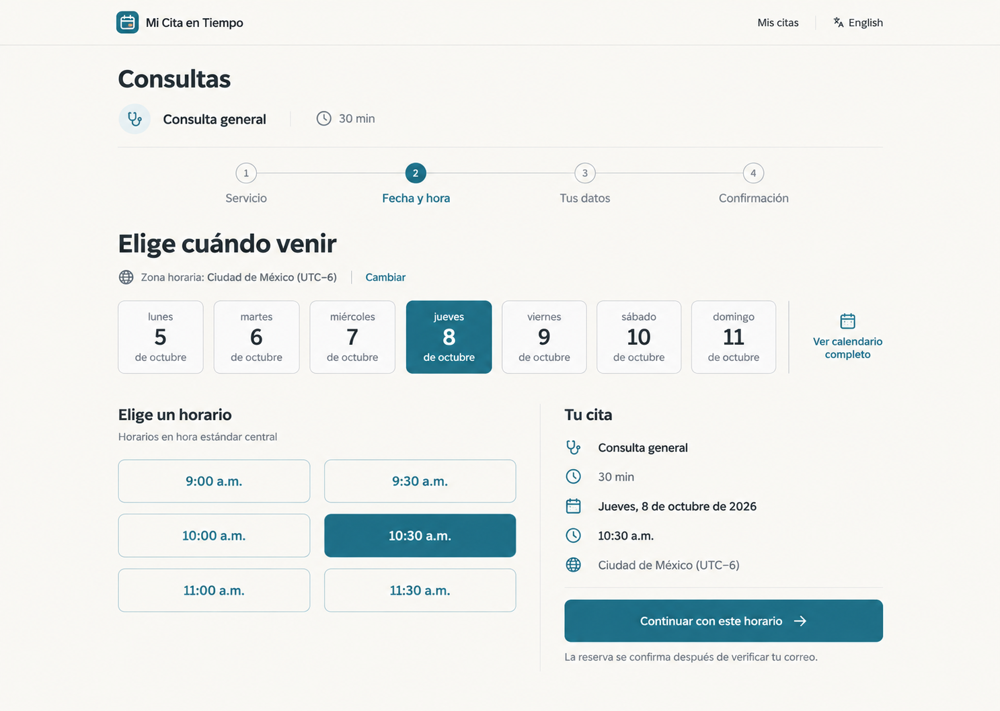
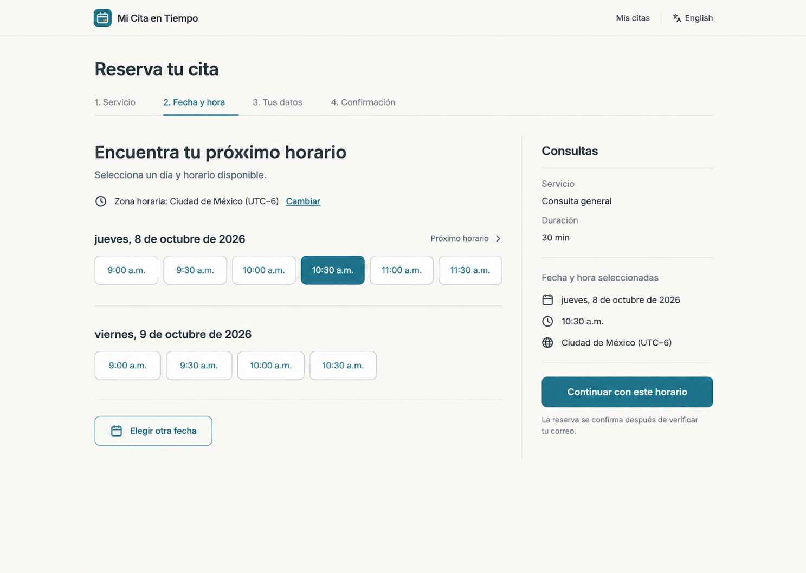

# Propuesta de diseño del frontend del cliente

Fecha: 7 de octubre de 2026. Rama: `design/propuesta-frontend-cliente`, creada desde `cfb28fa`.

**Estado: propuesta para revisión; no implementada.** La aplicación conserva su código. Esta entrega contiene la auditoría, tres conceptos visuales y el alcance de implementación recomendado.

Recomiendo evolucionar la identidad existente hacia una **reserva con contexto**: identificar negocio, servicio, duración y zona horaria antes de elegir; mostrar una etapa real por cada decisión; facilitar el regreso a Mis citas. En las páginas comerciales, sustituir la repetición de tarjetas por una demostración del recorrido y beneficios jerarquizados.

## Entregables

- **[Traspaso para el siguiente agente: tareas pendientes y cómo verificarlas](HANDOFF.md).** Empieza por aquí si vas a implementar.
- [Propuesta por página, sistema visual, fases y aceptación](PROPUESTA.md).
- [Auditoría con 14 capturas inspeccionadas](AUDITORIA.md).
- [Validación y límites de la evidencia](VALIDACION.md).
- [Prompts completos de las tres imágenes](PROMPTS.md).
- [Medición del formulario de contacto](mediciones-contacto.json) y [contrastes de tokens](contrastes.json).

## Tres alternativas visuales

Numeradas en el mismo orden en que se mostraron en la conversación. Son imágenes conceptuales del selector de reserva, no pantallas implementadas ni pruebas de funcionamiento. El resto de las páginas está especificado en la propuesta.

### 1. Agenda con contexto — recomendada

Mes completo, contexto del servicio a la izquierda y horarios con resumen a la derecha. Es la evolución más cercana al comportamiento existente y conserva la visión del mes.

### 2. Reserva guiada

Semana visible y formulario por decisiones. Favorece reservas próximas, con acceso explícito al calendario completo. Necesita una estrategia clara para navegar semanas y mostrar fechas no disponibles.

### 3. Próximo horario

Disponibilidad agrupada por fecha y resumen lateral. Favorece encontrar el primer horario conveniente. Debe conservar la selección de fechas lejanas y limitar la cantidad inicial de horarios.

## Decisión recomendada

Elegir el concepto 1 como base y aplicar su jerarquía a móvil: resumen breve arriba, calendario compacto, horarios debajo y acción de continuar tras seleccionar. El concepto 3 puede evaluarse después como vista alternativa si las pruebas con clientes muestran preferencia por la primera disponibilidad.

Los conceptos requieren ajuste al implementarse: estados deshabilitados de fechas pasadas, contraste de contornos, indicador textual de selección y adaptación móvil. No se deben copiar literalmente los pequeños artefactos o decisiones incidentales de ImageGen.
