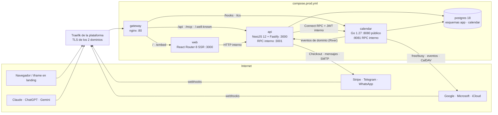
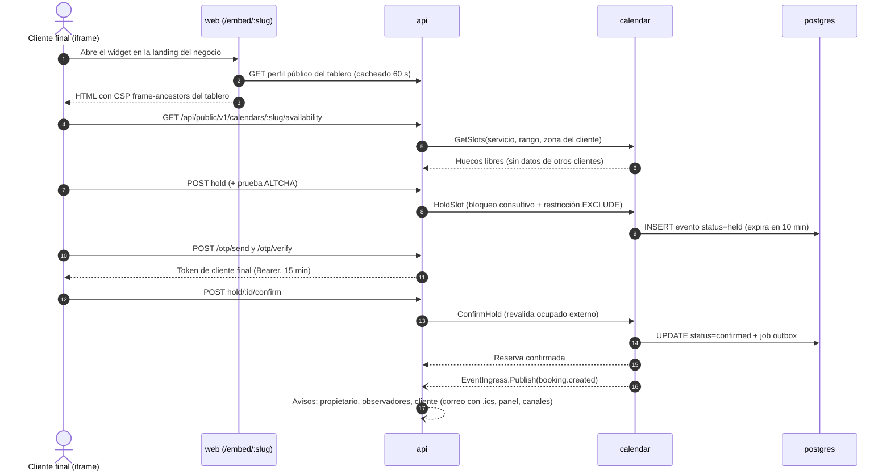
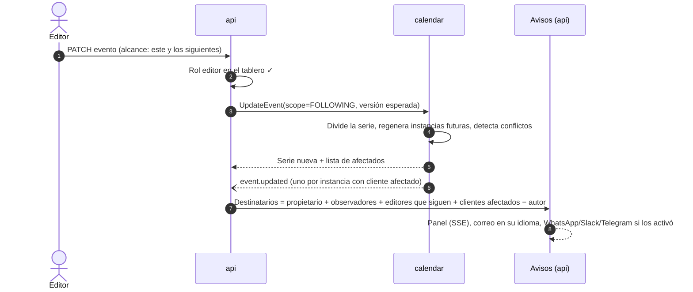
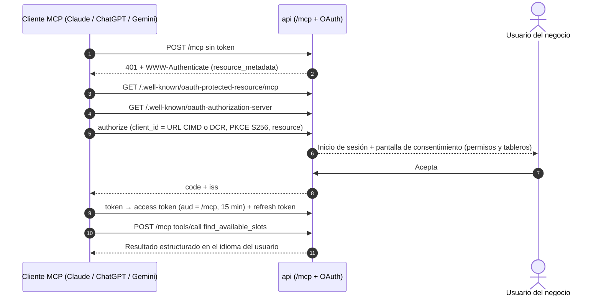

# 2. Arquitectura

Cinco contenedores en un solo `compose`: `gateway` (nginx) recibe todo; `web` (React SSR) pinta las
páginas; `api` (NestJS sobre Fastify) es el negocio y la única API pública; `calendar` (Go) es el motor
de calendario; `postgres` guarda todo, incluidas las colas. No hay Redis: todo estado durable queda en la
copia nocturna de PostgreSQL.

## 2.1 Vista general



## 2.2 Servicios

| Servicio | Imagen | Tecnología | Responsabilidad | Puertos internos | `mem_limit` |
|---|---|---|---|---|---|
| `gateway` | `${IMAGE_PREFIX}-gateway` | nginx 1.30 (rama estable) | Único punto de entrada; IP real; cabeceras; `/healthz`; `/version.json`; reparto por ruta; límites de peticiones | 80 | 64m |
| `web` | `${IMAGE_PREFIX}-web` | Node 24, React 19, React Router 8 (SSR) | Páginas públicas, panel, reserva, embed; idioma por `Host`; SEO; CSP con nonce | 3000 | 192m |
| `api` | `${IMAGE_PREFIX}-api` | Node 24, NestJS 12, Fastify 5 | Cuentas, organizaciones, roles, planes, Stripe, avisos, integraciones de mensajería, MCP, API pública de reservas | 3000 (vía gateway), 3001 (RPC interno) | 384m |
| `calendar` | `${IMAGE_PREFIX}-calendar` | Go 1.27, distroless | Tableros, horarios, feriados, servicios, disponibilidad, eventos, recurrencia, reservas, sincronización externa, ICS | 8080 (vía gateway: `/hooks`, `/ics`), 8081 (RPC interno) | 160m |
| `postgres` | `${IMAGE_PREFIX}-postgres` | PostgreSQL 18 | Datos de los dos servicios y sus colas (pg-boss y River) | 5432 | 512m |

Total: 1 312 MiB, por debajo del umbral de revisión de 1,5 GB.

## 2.3 Reparto de responsabilidades

**`calendar` (Go) decide todo lo que es tiempo:**

- Tableros, zona horaria, capacidad, política de embed.
- Horario laboral, descansos, excepciones por fecha, feriados por país y región.
- Servicios (duración, márgenes, antelación, ventana, intervalo, límite diario).
- Cálculo de disponibilidad, holds, reservas, eventos bloqueantes, series recurrentes.
- Garantía de no solapamiento en PostgreSQL.
- Sincronización con Google, Microsoft e iCloud; feeds ICS; generación de `.ics` para correos.
- Eventos de dominio (`event.created`, `booking.cancelled`…) hacia `api`.

**`api` (NestJS) decide todo lo que es negocio:**

- Identidad: registro, verificación de correo, sesiones por dominio, Google, códigos de un solo uso.
- Organizaciones, miembros por tablero, invitaciones, roles y permisos.
- Planes, prueba gratuita, Stripe, límites del plan, estado de la organización.
- Avisos: destinatarios, preferencias, canales (correo, panel, WhatsApp, Slack, Telegram), recordatorios.
- OAuth con Google y Microsoft para conectar calendarios (luego entrega los tokens a `calendar`).
- MCP: servidor de autorización OAuth 2.1 y endpoint `/mcp`.
- API REST para `web` y API pública de reservas para el embed.

**`web` no guarda estado ni toca la base de datos:** llama a `api` por la red interna.

## 2.4 Comunicación entre servicios

| De → a | Cómo | Seguridad |
|---|---|---|
| Navegador → `web`/`api` | HTTPS hasta Traefik, HTTP hasta `gateway`, mismo origen | Cookies por dominio (`__Host-`), `SameSite=Lax`, CSRF por origen |
| `web` → `api` | HTTP interno `http://api:3000` reenviando la cookie del usuario | Igual que el navegador |
| `api` → `calendar` | [Connect RPC](https://connectrpc.com) (protobuf, HTTP/1.1 o h2c) en `calendar:8081` | JWT interno HS256 de 60 s con el **actor** (usuario, organización, tablero, rol, idioma, zona); secreto `RPC_SECRET_API_TO_CALENDAR` |
| `calendar` → `api` | Job de River `deliver_domain_event` → RPC `EventIngress.Publish` en `api:3001` | JWT interno con `RPC_SECRET_CALENDAR_TO_API`; idempotente por `event_id` |
| Proveedores → `calendar` | `POST /hooks/google`, `POST /hooks/microsoft` vía gateway | Token de canal (Google) y `clientState` (Microsoft) |
| Stripe, Telegram, WhatsApp → `api` | `POST /api/webhooks/*` vía gateway | Firma de cada proveedor sobre el cuerpo crudo |
| IA → `api` | `POST /mcp` (Streamable HTTP) | Token OAuth 2.1 con audiencia `https://<dominio>/mcp` |

Los puertos 3001 y 8081 no tienen ruta en el gateway: solo se alcanzan desde la red interna, y además
exigen el JWT interno.

**Contratos:** los `.proto` viven en `packages/contracts/proto` y se gestionan con `buf` (lint y
detección de cambios incompatibles en CI). El código generado para Go y TypeScript se versiona en el
repositorio, para que las imágenes no necesiten el generador.

**Patrón outbox:** cada cambio del motor inserta, en la misma transacción, un job de River con el evento
de dominio. Si `api` está caído, River reintenta con espera exponencial; ningún aviso se pierde y ninguno
se duplica (tabla `app.inbound_events` con `event_id` único).

## 2.5 Datos

Una base de datos, `micita`, con un esquema y un rol por servicio. Un error en un servicio no puede leer
ni escribir los datos del otro.

| Esquema | Rol propietario | Contenido | Migraciones |
|---|---|---|---|
| `app` | `api` | Usuarios, sesiones, cuentas OAuth, verificaciones, organizaciones, miembros, invitaciones, suscripciones, avisos, canales, clientes OAuth de MCP, auditoría | Drizzle Kit (SQL generado y revisado), al arrancar `api` |
| `pgboss` | `api` | Cola de trabajos de NestJS | pg-boss |
| `calendar` | `calendar` | Tableros, reglas, feriados propios, servicios, series, eventos, conexiones externas, caché de ocupado, feeds ICS, tablas de River | goose (SQL embebido), al arrancar `calendar` |

- Identificadores UUIDv7 (`uuidv7()` nativo de PostgreSQL 18).
- Instantes en `timestamptz` (UTC). Las reglas de pared (horario laboral 09:00–18:00, `DTSTART` de una
  serie) se guardan como hora local + zona IANA, porque es lo único correcto con cambios de horario.
- Datos entre servicios por identificador, sin claves foráneas cruzadas. `calendar` guarda una copia
  mínima de los datos del asistente (nombre, correo, teléfono, idioma, zona) porque los necesita para
  ICS y sincronización.
- Archivos subidos: solo el logotipo del negocio (≤ 256 KB, PNG/WebP/SVG saneado), guardado en
  PostgreSQL para que entre en la copia. No hay volumen de archivos.

## 2.6 Identidad y autorización

1. `api` autentica: sesión por cookie (panel), token Bearer de corta duración (embed) o token OAuth (MCP).
2. `api` resuelve el rol del usuario en el tablero (`app.calendar_members` o cliente final).
3. `api` aplica la matriz de permisos (`01-requisitos.md` §1.6) y el estado del plan.
4. `api` llama a `calendar` con el actor firmado. `calendar` vuelve a aplicar las reglas que dependen
   del tiempo y de la visibilidad: un actor `customer` solo recibe sus eventos y nunca puede crear series.

## 2.7 Flujos principales

### Reserva desde el embed



### Un editor modifica un evento recurrente



### Conexión de Google Calendar

```mermaid
sequenceDiagram
  autonumber
  actor P as Propietario
  participant A as api
  participant Gg as Google
  participant C as calendar
  P->>A: Conectar Google al tablero
  A-->>P: Redirección a Google (scopes calendar.app.created, calendar.freebusy, calendar.calendarlist.readonly; state firmado; PKCE)
  P->>Gg: Consiente
  Gg-->>A: /api/integrations/google/callback?code
  A->>Gg: Intercambia code por tokens
  A->>C: UpsertConnection(tokens) — C cifra con AES-256-GCM
  C->>Gg: Crea el calendario «Mi Cita en Tiempo», lista calendarios, abre canal de avisos
  C-->>A: Conexión lista; el propietario elige qué calendarios cuentan como ocupado
```

### Conexión de una IA por MCP



## 2.8 Rutas del gateway

| Ruta | Destino | Notas |
|---|---|---|
| `= /healthz` | gateway | `200 ok` |
| `= /version.json` | gateway | `{"revision":"<sha>"}`, `no-store` |
| `/api/` | `api:3000` | Incluye `/api/auth/*`, `/api/v1/*`, `/api/public/v1/*`, `/api/webhooks/*`, `/api/integrations/*` |
| `= /api/v1/stream` | `api:3000` | SSE: `proxy_buffering off`, `proxy_read_timeout 1h` |
| `= /mcp` | `api:3000` | Streamable HTTP: sin búfer; CORS abierto sin credenciales |
| `/.well-known/oauth-protected-resource`, `/.well-known/oauth-authorization-server`, `/.well-known/openid-configuration`, `/.well-known/jwks.json` | `api:3000` | Metadatos OAuth para MCP (prefijo: cubre las variantes con ruta del RFC 8414 y el RFC 9728). Los endpoints `authorize`, `token`, `register` y `revoke` viven bajo `/api/auth/oauth2/*` y se anuncian en esos metadatos |
| `/hooks/` | `calendar:8080` | Avisos de Google y Microsoft |
| `/ics/` | `calendar:8080` | Feeds `.ics` con token; `Cache-Control: private, max-age=300` |
| `/embed/` | `web:3000` | Sin `X-Frame-Options`; la CSP la pone `web` según el tablero |
| `= /embed.js` | `web:3000` | Cargador del widget; caché 1 h |
| `/assets/` | `web:3000` | Inmutables, caché 1 año |
| `/` | `web:3000` | SSR; cabeceras de seguridad |

## 2.9 Tiempo y zonas horarias

- El servidor nunca usa la hora local del contenedor: todo `time.Time` en Go y `Date` en Node se trata en UTC.
- Cada tablero tiene zona IANA; cada usuario guarda la suya; cada reserva guarda la zona del cliente final.
- Las franjas se calculan en la zona del tablero y se muestran en la del visitante, con la del tablero
  visible si son distintas.
- Base de zonas: la del sistema en la imagen distroless y, como respaldo, `time/tzdata` embebida en Go;
  en el navegador, la de `Intl`. Un cambio de reglas de un país obliga a reconstruir imágenes (Renovate
  avisa de la nueva versión de Go o de la imagen base).
- Las fechas se muestran con nombre de mes (nunca `03/04`), en 12 h o 24 h según preferencia.

## 2.10 Decisiones que se registran como ADR en F0

`docs/adr/` empieza con estas decisiones, una por archivo: 0001 Monorepo pnpm + módulo Go;
0002 Cinco contenedores y gateway; 0003 Connect RPC interno y JWT de actor; 0004 Outbox con River;
0005 Esquemas y roles separados en PostgreSQL; 0006 Better Auth por dominio; 0007 React Router 8 en SSR;
0008 Feriados generados con `date-holidays`; 0009 Sincronización: nuestro sistema como fuente de verdad;
0010 MCP dentro de `api` con Better Auth como servidor OAuth; 0011 Pruebas por escenarios con
playwright-bdd.
