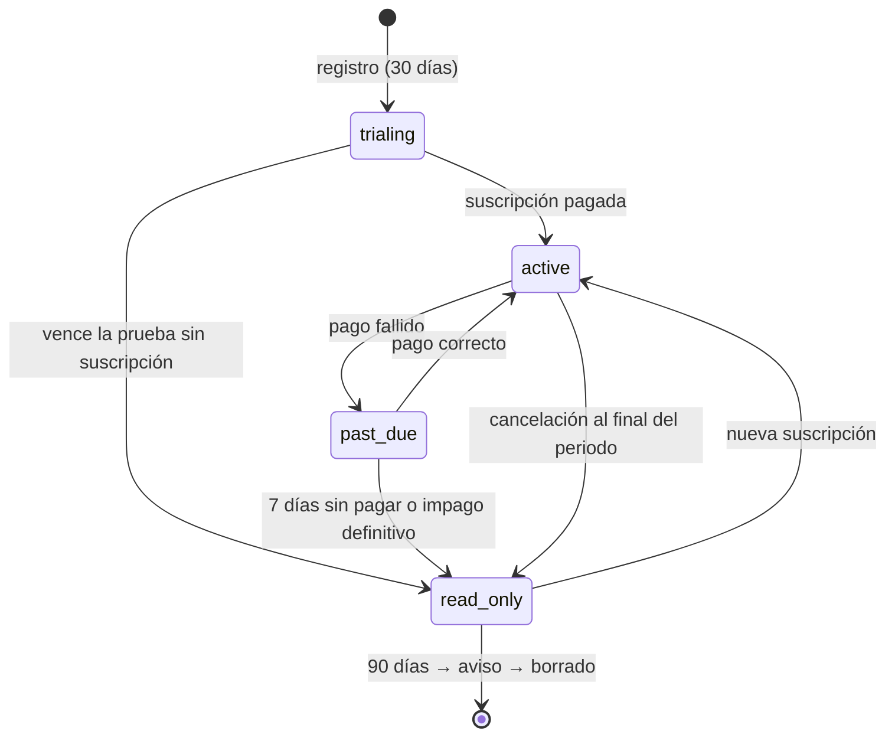
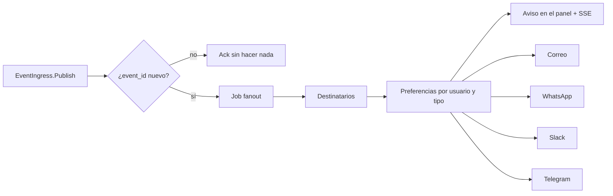

# 5. Negocio (`services/api`, NestJS 12 + Fastify 5)

`api` es la única API pública y el dueño de todo lo que no es tiempo: identidad, organizaciones, roles,
planes, cobro, avisos, integraciones de mensajería y MCP. Para cualquier operación de calendario aplica
permisos y plan, y delega en `calendar` por Connect RPC.

## 5.1 Estructura y convenciones

```
services/api/src/
  main.ts                    # Fastify, trustProxy=1, cierre ordenado, puertos 3000 y 3001
  config/                    # env validado con Zod; configuración por idioma (es/en)
  auth/                      # Better Auth por dominio, guardas, decoradores @Actor() @CalendarRole()
  orgs/                      # organizaciones, estado y límites del plan
  calendars/                 # fachada de calendar: tableros, ajustes, servicios, feriados, embed
  members/                   # miembros por tablero e invitaciones
  events/                    # eventos y reservas del panel (traducción de roles a actor)
  public-booking/            # API del embed y de la página pública
  customers/                 # clientes finales por negocio, exportación, anonimización
  billing/                   # planes, prueba, Stripe
  notifications/             # ingreso de eventos, destinatarios, preferencias, canales, SSE
  integrations/              # OAuth de Google/Microsoft para calendarios, iCloud, Slack, Telegram, WhatsApp
  mcp/                       # servidor MCP y configuración OAuth (06-mcp.md)
  newsletter/                # alta en Listmonk
  audit/                     # registro de auditoría
  jobs/                      # pg-boss: colas, horarios, reintentos
  internal-rpc/              # EventIngress (Connect sobre Fastify, puerto 3001)
  health/                    # /api/healthz (con revisión) y /readyz
  db/                        # Drizzle: esquema app, migraciones SQL versionadas
  test-support/              # solo con TEST_MODE: reloj, semillas (09-pruebas.md)
```

- **ESM** y paquetes de NestJS 12. TypeScript 6.0.3 (ver `03-versiones.md`).
- **Validación con Zod 4** mediante Standard Schema en `@Body({ schema })`, `@Query`, `@Param`. Los
  esquemas viven en `packages/schemas` y los comparte el frontend.
- **Errores** en `application/problem+json` (RFC 9457) con `type`, `title` localizado, `status`, `code`
  estable (`slot_taken`, `plan_limit`…) y `errors` por campo.
- **Rutas:** `/api/v1/*` (panel, sesión por cookie), `/api/public/v1/*` (embed y página pública, token
  Bearer de cliente final), `/api/webhooks/*`, `/api/integrations/*`, `/api/auth/*` (Better Auth), `/mcp`.
- **OpenAPI** generado por `@nestjs/swagger` y servido solo fuera de producción en `/api/docs`.
- **Logs** JSON con pino: id de petición, usuario y organización; nunca correos, teléfonos ni tokens.

## 5.2 Identidad (Better Auth)

- **Una instancia por dominio** (es y en), misma base de datos: `baseURL` = `SITE_URL_ES` o
  `SITE_URL_EN`, cookies solo para ese host (`__Host-`), emisor OAuth propio. Se elige por `Host`. Si
  Better Auth admite `baseURL` dinámico por petición en la versión vigente, se usa eso; en ambos casos la
  sesión de un dominio no vale en el otro (lo pide el README).
- **Proveedores:**
  - Correo y contraseña: hash Argon2id (`@node-rs/argon2`, m = 19 MiB, t = 2, p = 1; como máximo 4 hash
    a la vez para respetar la memoria); mínimo 12 caracteres, máximo 128, sin reglas de composición;
    rechazo de contraseñas filtradas con el plugin de Have I Been Pwned (k-anonimato: solo se envían 5
    caracteres del SHA-1).
  - Google (`openid email profile`): un solo cliente OAuth con los dos orígenes y las dos URI de retorno
    (`https://micitaentiempo.online/api/auth/callback/google` y
    `https://myappointmentontime.online/api/auth/callback/google`).
  - Código de un solo uso por correo (plugin `emailOTP`) para clientes finales.
- **Verificación de correo obligatoria** (`requireEmailVerification`) para cuentas con contraseña.
- **Vinculación de cuentas**: correo verificado + Google con el mismo correo → una sola cuenta.
- **Sesiones** de 7 días con renovación diaria; rotación al iniciar sesión; revocación de todas al cambiar
  la contraseña. Para el embed, plugin `bearer`: token de 15 min + renovación guardada en el almacenamiento
  particionado del iframe.
- **2FA TOTP** opcional para propietarios; passkeys en post-lanzamiento.
- **Campos propios del usuario:** `locale` (`es` | `en`, se fija por el dominio de registro y se puede
  cambiar), `timezone` (IANA, detectada en el registro y editable), `time_format` (`12h` | `24h`),
  `week_start` (1 lunes | 7 domingo) y `country`.
- **Exportar y borrar cuenta:** `GET /api/v1/me/export` (JSON) y `DELETE /api/v1/me` (si es propietario con
  suscripción activa, primero cancela). Borrar un cliente final llama a `AnonymizeCustomer` en
  `calendar`.

## 5.3 Validación del correo

1. Normalizar: recortar, Unicode NFC, dominio en minúsculas y en punycode.
2. Sintaxis: Zod `email()`, ≤ 254 caracteres, parte local ≤ 64.
3. DNS: registros MX (2 s de tiempo máximo, caché 1 h); sin MX, se aceptan A/AAAA (MX implícito, RFC 5321);
   un MX nulo (RFC 7505) se rechaza.
4. Dominios desechables: `mailchecker`.
5. Verificación: enlace de un solo uso (24 h) y código de 6 dígitos alternativo; reenvío limitado a 1 por
   minuto y 5 por hora.
6. Unicidad sin distinguir mayúsculas.

Los mensajes de error no revelan si una cuenta existe.

## 5.4 Organizaciones, tableros y miembros

Tablas del esquema `app` (además de las de Better Auth: `user`, `session`, `account`, `verification`,
`jwks` y las del proveedor OAuth):

| Tabla | Columnas clave |
|---|---|
| `organizations` | `id`, `name`, `owner_user_id`, `plan` (`personal` \| `branches`), `status` (`trialing` \| `active` \| `past_due` \| `read_only` \| `suspended`), `trial_ends_at`, `stripe_customer_id`, `stripe_subscription_id`, `current_period_end`, `cancel_at_period_end`, `country`, `deleted_at` |
| `calendar_members` | `calendar_id`, `user_id`, `role` (`owner` \| `editor` \| `observer`), `notify` (propietario y observador: sí; editor: no), `added_by` |
| `invitations` | `calendar_id`, `email`, `role`, `token_hash`, `expires_at` (7 días), `requires_google` (sí para editores), `accepted_at` |
| `customer_links` | `org_id`, `user_id`, `first_booking_at`, `last_booking_at`, `locale` (para listar clientes del negocio) |
| `audit_log` | `org_id`, `actor_user_id`, `via` (`panel` \| `mcp` \| `system`), `action`, `target`, `metadata`, `ip_hash`, `created_at` |

Flujos:

- **Crear tablero:** comprueba el límite del plan (1 o 10 activos), llama a `CreateCalendar` y registra al
  propietario como `owner`.
- **Invitar editor:** el propietario introduce un correo; el enlace lleva a «Continuar con Google»; si el
  correo de Google no coincide con el invitado, se rechaza con un mensaje claro y la invitación sigue viva.
- **Invitar observador:** igual, pero puede aceptar con Google o con correo y contraseña.
- **Quitar miembro:** revoca su acceso al instante (sesiones siguen vivas, pero cada petición vuelve a
  comprobar el rol).
- **Cliente final:** se crea al verificar su correo por primera vez en un tablero; `customer_links` lo une al
  negocio. No tiene organización.

## 5.5 Planes, prueba gratuita y facturación

| Plan | Precio | Tableros activos | Miembros por tablero | WhatsApp al mes |
|---|---|---|---|---|
| Personal | US$5/mes | 1 | 10 | 300 |
| Sucursales | US$20/mes | 10 | 10 | 1 500 |

Los límites viven en código (`billing/plans.ts`) y se exponen al frontend; los precios de Stripe se buscan
por `lookup_key` (`personal_monthly_usd`, `branches_monthly_usd`), creados por un script idempotente
(`pnpm --filter api stripe:setup`), así no hacen falta variables con ids de precio.

**Estados de la organización:**



- **Prueba gestionada por la app**, sin tarjeta: `trial_ends_at = registro + 30 días`; una prueba por cuenta
  verificada y por organización. Avisos a 7 y 3 días.
- **`read_only`**: el panel funciona en lectura, la página pública y el embed muestran «este calendario no
  acepta reservas por ahora», las citas ya confirmadas mantienen sus recordatorios, los feeds ICS siguen
  activos, MCP solo lee. Cada cambio de estado se refleja en `calendar` con `SetOrgStatus`.
- **Contratar:** Stripe **Embedded Checkout** (`ui_mode: 'embedded'`) dentro de `/panel/facturacion`,
  `mode: 'subscription'`, `metadata.org_id`, idioma del usuario, y `subscription_data.trial_end` con los
  días de prueba que queden (si faltan más de 48 h), para que contratar antes no haga perder la prueba.
  `automatic_tax` según `STRIPE_TAX_ENABLED`.
- **Cambiar de plan:** actualización de la suscripción con prorrateo. Bajar de Sucursales a Personal exige
  dejar un solo tablero activo (la interfaz pide archivar los demás).
- **Cancelar:** `cancel_at_period_end`; reanudar mientras no termine el periodo.
- **Método de pago:** SetupIntent + Payment Element en nuestra página. **Facturas:** listado por API con
  enlace al PDF.
- **Webhooks** (`/api/webhooks/stripe`): firma verificada sobre el cuerpo crudo; id del evento en
  `billing_events` (único); el procesamiento vuelve a leer la suscripción de Stripe (inmune al desorden de
  eventos). Eventos: `checkout.session.completed`, `customer.subscription.created|updated|deleted|paused|resumed`,
  `invoice.paid`, `invoice.payment_failed`.

## 5.6 Avisos



**Destinatarios** por evento: propietario, observadores y editores con `notify` del tablero, más el cliente
final afectado; nunca el autor del cambio. Un cambio de serie produce un solo aviso resumen.

**Preferencias:** matriz por usuario de grupo de aviso (`reservas`, `cambios`, `recordatorios`,
`facturación`, `sistema`) × canal, más silenciar un tablero. El panel siempre recibe los avisos del personal;
el correo está activo por defecto; WhatsApp, Slack y Telegram requieren vincularlos primero.

| Canal | Alta | Envío | Detalles |
|---|---|---|---|
| Panel | Siempre | Fila en `notifications` + evento SSE | Contador de no leídos, marcar como leído, 90 días de retención |
| Correo | Correo verificado | SMTP de la plataforma con credenciales y remitente del idioma del destinatario | Plantillas React Email es/en, texto plano alternativo, `.ics` en reservas, `List-Unsubscribe` de un clic (RFC 8058) en avisos no esenciales |
| WhatsApp | Teléfono E.164 verificado con código enviado por WhatsApp (plantilla de autenticación) | WhatsApp Business Cloud API (Meta), plantillas de utilidad aprobadas en es y en | Cupo mensual por plan; gestionar bajas («STOP»); requiere cuenta de Meta verificada |
| Slack | «Añadir a Slack» (OAuth v2, permiso `incoming-webhook`); el usuario elige canal | Webhook entrante con Block Kit | URL cifrada con `APP_ENC_KEY`; si Slack devuelve 404/410, se desactiva y se avisa en el panel |
| Telegram | Botón que abre `https://t.me/<bot>?start=<token de 10 min>`; el bot recibe `/start` y vincula el chat | `sendMessage` con HTML escapado | Webhook con `X-Telegram-Bot-Api-Secret-Token`; si el usuario bloquea el bot, se desactiva |

**Recordatorios:** al recibir `booking.created` o `booking.rescheduled`, se programan trabajos de pg-boss a
24 h y 1 h (configurable por tablero) con clave única por cita y desfase. Al dispararse, consultan la cita
en `calendar` y solo envían si sigue confirmada y con la misma hora.

**Entrega:** un trabajo por destinatario y canal, clave de idempotencia `event_id + usuario + canal`, 5
reintentos con espera exponencial y registro en `notification_deliveries`. Si un canal falla de forma
definitiva, se avisa en el panel.

**Contenido:** idioma y zona horaria del destinatario, enlaces al dominio de su idioma, sin datos de otros
clientes finales.

## 5.7 API REST

| Grupo | Endpoints principales |
|---|---|
| Cuenta | `GET/PATCH /api/v1/me`, `GET /api/v1/me/export`, `DELETE /api/v1/me` |
| Organización | `GET/PATCH /api/v1/org`, `GET /api/v1/org/usage` |
| Tableros | `GET/POST /api/v1/calendars`, `GET/PATCH/DELETE /api/v1/calendars/:id`, `…/:id/hours`, `…/:id/overrides`, `…/:id/holidays`, `…/:id/services`, `…/:id/embed` |
| Miembros | `GET/POST/DELETE /api/v1/calendars/:id/members`, `POST /api/v1/calendars/:id/invitations`, `POST /api/v1/invitations/:token/accept` |
| Eventos | `GET /api/v1/calendars/:id/events?from&to`, `POST …/events`, `PATCH …/events/:eventId?scope=this\|following\|all`, `POST …/events/:eventId/cancel`, `DELETE …/events/:eventId` (bloqueos), `POST …/events/:eventId/attendance` |
| Disponibilidad | `GET /api/v1/calendars/:id/availability?service&from&to&tz` |
| Clientes | `GET /api/v1/customers`, `GET /api/v1/customers/:id` |
| Estadísticas | `GET /api/v1/stats?calendar&from&to&groupBy` |
| Avisos | `GET /api/v1/notifications`, `POST /api/v1/notifications/:id/read`, `GET/PUT /api/v1/notification-preferences`, `GET /api/v1/stream` (SSE) |
| Canales | `POST /api/v1/channels/telegram/link`, `POST /api/v1/channels/whatsapp/verify`, `GET /api/integrations/slack/install`, `DELETE /api/v1/channels/:channel` |
| Integraciones de calendario | `GET /api/v1/integrations`, `GET /api/integrations/google/connect?calendar`, `GET /api/integrations/google/callback`, ídem Microsoft, `POST /api/v1/integrations/icloud`, `PATCH /api/v1/integrations/:id/calendars/:extId`, `DELETE /api/v1/integrations/:id` |
| Feeds ICS | `GET/POST /api/v1/calendars/:id/feeds`, `DELETE /api/v1/feeds/:id`, `POST /api/v1/me/feeds` (feed personal) |
| Facturación | `GET /api/v1/billing`, `POST /api/v1/billing/checkout`, `POST /api/v1/billing/change-plan`, `POST /api/v1/billing/cancel`, `POST /api/v1/billing/resume`, `POST /api/v1/billing/setup-intent`, `GET /api/v1/billing/invoices` |
| IA (MCP) | `GET /api/v1/ai/connections`, `DELETE /api/v1/ai/connections/:id`, `POST /api/v1/ai/static-clients` (Gemini Enterprise) |
| Pública (embed) | `GET /api/public/v1/calendars/:slug`, `GET …/:slug/availability`, `POST …/:slug/holds`, `POST /api/public/v1/otp/send`, `POST /api/public/v1/otp/verify`, `POST /api/public/v1/holds/:id/confirm`, `GET /api/public/v1/my/bookings`, `PATCH/POST cancel /api/public/v1/my/bookings/:id` |
| Newsletter | `POST /api/public/v1/newsletter` → `POST /api/public/subscription` del Listmonk del idioma |
| Salud | `GET /api/healthz` → `{"status":"ok","revision":"<sha>"}` |

Las reservas del embed llevan `Idempotency-Key`. Las respuestas públicas nunca incluyen datos de otros
clientes finales.

## 5.8 Seguridad específica

| Control | Detalle |
|---|---|
| Límites de peticiones | nginx (`limit_req` por IP real) + `@fastify/rate-limit` por usuario/token: inicio de sesión 10/min, registro 5/h por IP, OTP 5/h por correo, holds 30/min por IP, disponibilidad 120/min por IP, MCP 120/min por token y 600/min por organización |
| Antibots | ALTCHA (prueba de trabajo autoalojada, sin terceros ni marcas) en registro, OTP, holds y newsletter |
| CSRF | Cookies `SameSite=Lax`; las mutaciones de `/api/v1` exigen `Origin` igual al host y `Content-Type: application/json`; Better Auth valida orígenes |
| CORS | Ninguno en `/api/v1` ni `/api/public/v1` (el embed es del mismo origen); `/mcp` y `/.well-known/*` con `*` y sin credenciales |
| Cabeceras | `@fastify/helmet`: `default-src 'none'`, `frame-ancestors 'none'` en respuestas JSON |
| IP real | `trustProxy: 1`: el gateway sobrescribe `X-Forwarded-For` con un único valor |
| Secretos en reposo | URLs de Slack cifradas (AES-256-GCM con `APP_ENC_KEY`); tokens de calendarios los cifra `calendar` |
| Contenido no confiable | `customer_notes` se muestra como texto plano y viaja marcado como no confiable hacia MCP |
| Auditoría | Cambios de rol, invitaciones, conexiones, facturación y toda escritura vía MCP |
| Aislamiento | Toda consulta filtra por organización o tablero; pruebas de IDOR para cada endpoint (09-pruebas.md §9.4) |

## 5.9 Configuración y memoria

Variables (ver la tabla completa en `08-infraestructura.md` §8.8): idiomas y URLs, SMTP por idioma,
Listmonk por idioma, base de datos, `BETTER_AUTH_SECRET`, secretos RPC, `APP_ENC_KEY`, `ALTCHA_HMAC_KEY`,
Google, Microsoft, Stripe, Slack, Telegram, WhatsApp y `TEST_MODE` (prohibida en producción).

Memoria: `mem_limit: 384m`, `NODE_OPTIONS=--max-old-space-size=256`; pool de `pg` de 15 conexiones y 5 para
pg-boss.
