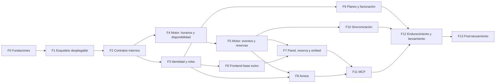

# 10. Fases de ejecución

Trece fases, cada una con su rama y su PR. Cada fase termina con todo en verde, sus escenarios
automatizados y este plan actualizado si algo cambió. Tamaño relativo: S < M < L < XL.

Tras F2 hay dos líneas que pueden avanzar en paralelo (en sesiones o worktrees distintos): **Go** (F4 → F5
→ F10) y **TypeScript** (F3 → F6 → F7/F8/F9 → F11).

**Hecho significa** (para todas las fases): Biome, tipos, unitarias, integración, permisos y escenarios de
la fase en verde; claves i18n completas en es y en; sin secretos en el diff; `03-versiones.md` y ADR
actualizados si hubo cambios; commit y push en la rama de la fase.

---

## F0 · Fundaciones del repositorio — S · Opus 5.5 `high`

**Objetivo:** un monorepo limpio donde cualquier sesión sepa trabajar.

- [ ] Monorepo pnpm 12.9.1 (`packageManager`, `pnpm-workspace.yaml` con `minimumReleaseAge: 1440`):
      `services/{gateway,web,api,calendar,postgres}`, `packages/{contracts,schemas,i18n,tsconfig}`,
      `tools/holidays-gen`, `tests/{escenarios,fakes,permisos}`, `content/{es,en}`.
- [ ] Biome 2.5 para todo TypeScript; TypeScript 6.0.3 en `api` y 7.0.2 en el resto; módulo Go
      `github.com/yitztech/micitaentiempo.online/services/calendar` con golangci-lint v2; `buf.yaml`.
- [ ] `.gitignore`, `.dockerignore` (de la plantilla, ampliados), `.editorconfig`, `.env.example` completo (§8.8).
- [ ] `CLAUDE.md` del repo: qué es cada servicio, comandos, reglas (repo público, contrato de la
      plataforma, leer `docs/plan/` antes de cada fase, versiones verificadas en su fuente).
- [ ] ADR 0001–0011 (`02-arquitectura.md` §2.10).
- [ ] `ci.yml` inicial (lint, tipos, pruebas vacías), plantilla de PR con la lista de «Hecho», Renovate o Dependabot.
- [ ] `README.md` del repo: conservar el contrato y añadir «Desarrollo local».

**Aceptación:** `pnpm install`, `pnpm lint`, `pnpm typecheck` y `go build ./...` sin errores; CI verde.

## F1 · Esqueleto desplegable — M · Opus 5.5 `high`

**Objetivo:** cumplir el contrato de la plataforma con servicios mínimos y el arnés de escenarios en marcha.

- [ ] `gateway` desde la plantilla con las rutas de `02-arquitectura.md` §2.8, `/healthz`, `/version.json`,
      IP real, límites y cabeceras (§8.5).
- [ ] Imagen `postgres` con roles, esquemas, `btree_gist` y `postgresql.conf` (§8.6).
- [ ] `web`: React Router 8 SSR, middleware de idioma por `Host`, `/healthz`, portada provisional en es y en
      con `lang`, `hreflang`, `canonical` y CSP con nonce.
- [ ] `api`: NestJS 12 + Fastify, configuración validada, Drizzle y primera migración, `/api/healthz` con
      revisión, logs pino.
- [ ] `calendar`: `serve`, `migrate` y `healthcheck`; goose; `/healthz` y `/readyz`.
- [ ] `compose.yml` (desarrollo con `develop.watch` y Mailpit), `compose.prod.yml` (§8.3) y `compose.ci.yml`.
- [ ] `deploy.yml`: pruebas → publicar 5 imágenes → Coolify → comprobar `/version.json` y `/api/healthz`.
- [ ] Arnés de escenarios: playwright-bdd, actores, dominios locales, Mailpit, informes; escenarios `@humo`
      de salud, versión e idioma por dominio.

**Aceptación:** `docker compose up --watch` funciona; `docker compose -f compose.prod.yml config` valida con
variables ficticias; CI construye las 5 imágenes sin vulnerabilidades críticas; `@humo` en verde; consumo en
reposo dentro de los límites (`docker stats`).

## F2 · Contratos y comunicación interna — M · Opus 5.5 `xhigh`

**Objetivo:** `api` y `calendar` hablan de forma tipada, autenticada y sin perder eventos.

- [ ] `.proto` de `mcet.calendar.v1` y `mcet.api.v1` (`EventIngress`); `buf lint` y `buf breaking` en CI;
      código Go y TS generado y versionado.
- [ ] JWT interno HS256 con actor en ambos sentidos (interceptores Connect); mapeo de errores Connect ↔
      `problem+json`.
- [ ] River en `calendar`; job `deliver_domain_event`; `EventIngress.Publish` en `api:3001` con
      `inbound_events` para deduplicar.
- [ ] Propagación de `X-Request-Id` y trazas OpenTelemetry.
- [ ] `TEST_MODE`: reloj controlable y semillas (`/__test/*`), con el bloqueo de arranque en dominios reales.

**Aceptación:** prueba de integración `api` → `calendar` con actor; un evento publicado llega una sola vez
aunque se reintente; JWT caducado o ausente rechazado; escenario: los puertos 3001 y 8081 no son alcanzables
por el gateway.

## F3 · Identidad, organizaciones y roles — L · Opus 5.5 `xhigh`

**Objetivo:** RF-01, RF-02, RF-08, RF-09 y la base de RF-10.

- [ ] Better Auth por dominio: correo y contraseña (Argon2id, HIBP), verificación obligatoria (enlace y
      código), Google, vinculación de cuentas, sesiones `__Host-`, `bearer` para el embed, `emailOTP` para
      clientes finales, 2FA opcional.
- [ ] Validación de correo completa (`05-negocio-api.md` §5.3).
- [ ] Organizaciones con plan elegido y prueba de 30 días; `calendar_members`; invitaciones (editor solo con
      Google y mismo correo; observador con cualquier método); `customer_links`.
- [ ] Guardas, decoradores y la matriz de permisos con pruebas generadas (§9.4).
- [ ] ALTCHA, límites de peticiones, comprobación de `Origin`, auditoría.
- [ ] Correos de verificación, invitación y recuperación (React Email, es y en, SMTP del idioma).
- [ ] Exportar y borrar cuenta.

**Aceptación:** escenarios de registro (correo y Google), verificación obligatoria, correo inválido o
desechable, sesión por dominio, invitación de editor con correo coincidente y no coincidente, observador en
solo lectura; matriz de permisos en verde.

## F4 · Motor: tableros, horarios, feriados y disponibilidad — L · Opus 5.5 `xhigh`

**Objetivo:** RF-05 y RF-06 en el motor, y disponibilidad correcta siempre (RNF-10).

- [ ] Migraciones: `org_status`, `calendars`, `hours`, `date_overrides`, `holiday_policies`,
      `custom_holidays`, `services`.
- [ ] `tools/holidays-gen` + datos embebidos por país con carga perezosa + `holidays-refresh.yml` + atribución.
- [ ] `availability.Compute` pura; corredor de escenarios YAML con ≥ 40 casos (§9.3); pruebas de propiedades.
- [ ] RPC de `CalendarService`, `ScheduleService`, `ServiceCatalogService` y `AvailabilityService`.
- [ ] Endpoints de `api` para tableros, ajustes, servicios, feriados y disponibilidad, con límite del plan.

**Aceptación:** escenarios YAML y de cambio de horario en verde; p95 < 50 ms dentro del motor para 31 días
(benchmark); Personal no pasa de 1 tablero y Sucursales de 10.

## F5 · Motor: eventos, recurrencia, reservas y concurrencia — XL · Opus 5.5 `xhigh`

**Objetivo:** RF-10, RF-11, RF-12 y la garantía contra la doble reserva.

- [ ] `series` y `events` con la restricción `EXCLUDE` por asiento y bloqueo consultivo por tablero.
- [ ] Subconjunto RRULE (parseo, validación, expansión en hora de pared) + pruebas diferenciales con
      `rrule-go` y ejemplos del RFC 5545.
- [ ] Eventos con alcance `this`/`following`/`all`, conflictos (`abort`/`skip`), materialización a 18 meses y
      `extend_series`.
- [ ] Holds, confirmación con revalidación, liberación, reprogramación atómica, cancelación con política,
      idempotencia y concurrencia optimista.
- [ ] Visibilidad del actor `customer`; prohibido crear series; marcar asistencia; `StatsService`.
- [ ] Eventos de dominio para todo cambio; `RenderICS`.
- [ ] Endpoints del panel y de la API pública del embed (OTP, ALTCHA, `Idempotency-Key`).

**Aceptación:** prueba de 50 reservas simultáneas; escenarios de serie semanal con «este y los siguientes»,
bloqueo, hold que caduca, cliente que no ve a otros y que no puede crear series.

## F6 · Frontend base en español e inglés — L · Opus 5.5 `high`

**Objetivo:** RF-16, RF-20 y la base de RF-17.

- [ ] Tokens de diseño (paleta, tipografía, modo oscuro) y componentes base (`07-frontend.md` §7.7).
- [ ] `packages/i18n`: catálogos es/en tipados, comprobación en CI, mapa de rutas, `hreflang`, `canonical`,
      `x-default`, `sitemap.xml` y `robots.txt` por dominio, selector de idioma sin redirección.
- [ ] Páginas públicas en los dos idiomas: inicio, funciones, precios, preguntas frecuentes, «Conecta tu IA»
      (contenido final en F11), contacto con newsletter, privacidad, condiciones, créditos, 404 y 500.
- [ ] Páginas de acceso conectadas a F3.
- [ ] CSP con nonce y cabeceras por ruta; Umami.

**Aceptación:** escenario de idiomas y SEO en los dos dominios; axe sin violaciones serias; presupuestos de
rendimiento de §7.9 en páginas públicas; ningún texto fuera de los catálogos.

## F7 · Panel, reserva, «Mis citas» y embed — XL · Opus 5.5 `high`

**Objetivo:** RF-05 a RF-12 y RF-17 en la interfaz.

- [ ] Asistente de alta (plan, tablero, horario y descansos, feriados con vista previa, servicio, compartir).
- [ ] Panel: inicio, calendario adaptable con FullCalendar 7, editor de eventos con recurrencia y alcance,
      bloqueos, conflictos, tiempo real por SSE.
- [ ] Ajustes del tablero, equipo (invitar y quitar), clientes y asistencia.
- [ ] Página de reserva, «Mis citas» y embed (iframe, `embed.js` con modos, altura automática, eventos al
      anfitrión, token Bearer en el iframe).
- [ ] Campana de avisos (la alimenta F8).
- [ ] Capturas visuales en 360, 768, 1024 y 1440 px.

**Aceptación:** escenarios de reserva en móvil, serie semanal, bloqueo, «Mis citas» y embed en es y en;
capturas aprobadas; axe sin violaciones serias.

## F8 · Avisos multicanal y recordatorios — L · Opus 5.5 `high`

**Objetivo:** RF-13, RF-14 y RF-22.

- [ ] Ingreso → difusión → destinatarios → preferencias → canales (`05-negocio-api.md` §5.6).
- [ ] Correos de todos los eventos (es y en, `.ics`, `List-Unsubscribe`); bandeja del panel con SSE.
- [ ] Telegram (enlace del bot), Slack (OAuth `incoming-webhook`) y WhatsApp (verificación, plantillas,
      cupo), activables por variable de entorno.
- [ ] Recordatorios a 24 h y 1 h; registro de entregas; reintentos; aviso si un canal falla.
- [ ] Pantalla de preferencias.

**Aceptación:** escenarios de aviso a propietario y observadores en su idioma, vinculación de Telegram,
recordatorios con reloj controlado, sin aviso al autor y un solo aviso por cambio de serie.

## F9 · Planes, prueba gratuita y facturación — L · Opus 5.5 `xhigh`

**Objetivo:** RF-03 y RF-04.

- [ ] Script de Stripe por `lookup_key`; Embedded Checkout con días de prueba restantes; webhooks
      idempotentes que releen la suscripción.
- [ ] Máquina de estados de la organización y efectos de `read_only` en `api`, `calendar` y `web`.
- [ ] Cambio de plan (bajar exige un solo tablero activo), cancelar y reanudar, método de pago, facturas.
- [ ] Avisos de fin de prueba (7 y 3 días) y de pago fallido; Stripe Tax con interruptor.
- [ ] CSP y `Permissions-Policy` de las rutas de facturación.

**Aceptación:** escenarios de contratar Personal, pago fallido → solo lectura, prueba vencida y bajada de
plan; reenvío de webhooks sin efectos dobles; eventos fuera de orden bien resueltos.

## F10 · Sincronización con Google, Outlook y Apple — XL · Opus 5.5 `xhigh`

**Objetivo:** RF-15 (`04-motor-calendario.md` §4.9).

- [ ] Nivel 1: feeds ICS de tablero y de cliente final, tokens revocables, instrucciones `webcal://`,
      botones «Añadir al calendario».
- [ ] Google: OAuth incremental en `api`, credenciales cifradas en `calendar`, calendario de la app,
      `freebusy`, escritura, canal `watch` + `syncToken`, política de fuente de verdad.
- [ ] Microsoft: OAuth `common`, `getSchedule`/`calendarView`, calendario propio, suscripciones + `delta`.
- [ ] iCloud: contraseña de app, descubrimiento CalDAV, ocupado con sus tres alternativas, `PUT`, sondeo.
- [ ] Reconciliación cada 15 min, salud de conexiones, «Reconectar», clasificación de errores.
- [ ] Dobles de Google y Graph, Radicale en pruebas; guion y vídeo para la verificación de Google.

**Aceptación:** escenarios de ocupado externo que bloquea, reserva que aparece en el calendario de la app,
cambio externo restaurado, credencial revocada y contenido de los feeds.

## F11 · MCP: conecta tu IA — L · Opus 5.5 `xhigh`

**Objetivo:** RF-18 (`06-mcp.md`).

- [ ] Better Auth `oauth-provider` + `mcp` + `cimd` + `jwt` por dominio; metadatos RFC 9728 y RFC 8414;
      DCR con límites; clientes estáticos para Gemini Enterprise; consentimiento en `web`.
- [ ] Endpoint `/mcp` con el SDK v2 y el adaptador de Fastify; todas las herramientas de §6.4 con
      anotaciones, `outputSchema`, `securitySchemes`, contenido no confiable marcado y enmascarado de datos.
- [ ] Recursos, prompts, límites y auditoría.
- [ ] Panel → IA y página «Conecta tu IA» con pasos por cliente; correo al conectar.
- [ ] Pruebas de §6.6; verificación manual con Claude, ChatGPT y Gemini CLI.

**Aceptación:** escenarios de MCP en verde; lista de verificación manual firmada; MCP Inspector sin errores.

## F12 · Endurecimiento y lanzamiento — L · Opus 5.5 `xhigh`

**Objetivo:** salir a producción con garantías.

- [ ] Revisión de seguridad con ASVS 5.0 nivel 2, `/security-review` y `/code-review`; ZAP *baseline*;
      verificación de cabeceras y CSP; escaneo de secretos del historial.
- [ ] k6 con los límites de memoria; `docker stats` bajo carga; ajuste de PostgreSQL.
- [ ] Catálogo completo de escenarios en verde (nocturno), capturas y accesibilidad.
- [ ] Legales finales en es y en: privacidad (incluye MCP, IA de terceros y encargados: Stripe, Meta, Slack,
      Telegram, Google, Microsoft, Apple), condiciones y acuerdo de encargo de datos para negocios.
- [ ] Verificación de Google OAuth, verificación de editor en Microsoft, Stripe en modo real, plantillas de
      WhatsApp aprobadas, app de Slack distribuible, perfil del bot de Telegram.
- [ ] Simulacro de restauración y `docs/operacion.md` (desplegar, volver atrás, rotar secretos, incidentes,
      restaurar).
- [ ] Lista §8.13 completa, primer despliegue, `TRUSTED_PROXY_CIDR`, humo en producción.

**Aceptación:** `/version.json` y `/api/healthz` con el SHA desplegado; `@humo-produccion` en verde; lista
§8.13 cerrada.

## F13 · Post-lanzamiento (opcional, priorizar con datos)

Ideas de DayOtter (`11-dayotter.md`): aviso «voy tarde», horarios recomendados, panel de analítica y CSV,
reparto entre profesionales de una sucursal. Además: API pública v1 con claves y webhooks salientes, MCP
Apps, sincronización bidireccional completa, MCP para clientes finales, asistente dentro de la app,
passkeys, PWA, cobro por cita con Stripe Connect, páginas de reserva indexables y francés de Canadá.
